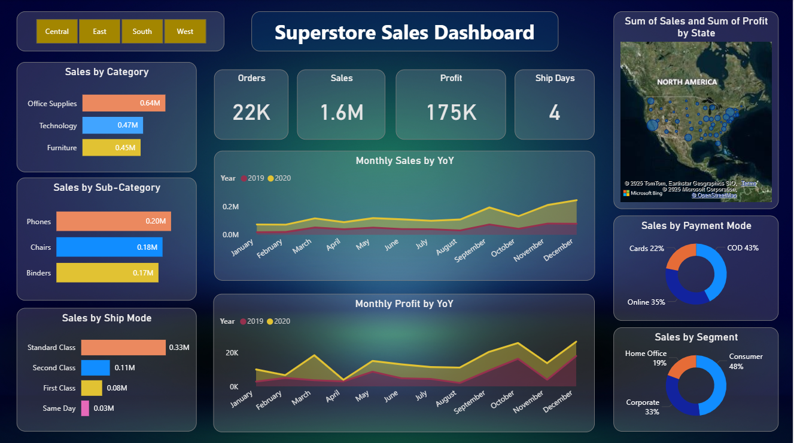

# Superstore Sales Intelligence Dashboard – Power BI

## 📌 Project Overview
This project is an end-to-end Power BI dashboard built to analyze Superstore retail sales data.
It provides insights into sales performance, profitability, customer segments, and includes
short-term sales forecasting to support data-driven decision-making.

The dashboard is designed with a business-analyst mindset, focusing on KPIs, trends,
and actionable insights rather than just visualizations.

---

## 🎯 Business Objectives
- Analyze overall sales, profit, and order trends
- Identify high and low-performing product categories and sub-categories
- Compare regional and state-wise sales performance
- Understand customer segment contribution
- Forecast short-term sales trends for planning

---

## 🛠 Tools & Technologies
- Power BI Desktop  
- DAX (Data Analysis Expressions)  
- Power Query (Data Cleaning & Transformation)  
- CSV Dataset (Superstore Sales Data)

---

## 📊 Dashboard Pages & Features

### 1️⃣ Sales Overview
- KPIs: Total Sales, Total Profit, Total Orders, Average Ship Days
- Sales by Category and Sub-Category
- Sales by Ship Mode
- Region-based slicers for interactivity

### 2️⃣ Regional & Category Analysis
- State-wise sales analysis using map visualization
- Sales and profit comparison by region
- Category and sub-category performance analysis

### 3️⃣ Sales Forecasting
- 15-day sales forecast using Power BI built-in time series forecasting
- Confidence interval visualization
- Historical vs forecasted sales comparison

---

## 📈 Key Metrics (DAX)
- Total Sales  
- Total Profit  
- Profit Margin  
- Total Orders  
- Average Shipping Days  

---

## 🔍 Key Insights
- Technology category contributes the highest profit.
- Furniture category shows inconsistent profitability across sub-categories.
- West and East regions generate the highest revenue.
- Consumer segment contributes the largest share of sales.
- Sales forecast indicates a short-term upward trend with daily volatility.

---

## 🔮 Forecasting Methodology
Sales forecasting was implemented using Power BI’s built-in
time-series forecasting (Exponential Smoothing) based on historical daily sales data.

---

## ▶️ How to Use This Project
1. Download the `.pbix` file from this repository  
2. Open it using **Power BI Desktop**  
3. Refresh the data if required  
4. Use slicers and visuals to explore insights interactively  

---

## 📂 Dataset
- Sample Superstore Sales Dataset  
- Public dataset commonly used for retail analytics practice

---

## 📸 Dashboard Preview

### Sales Overview

### Regional & Category Analysis

### Sales Forecast

---

## 📌 Note
This project was created for learning and portfolio purposes to demonstrate
Power BI, DAX, and business analytics skills.

---

## 👤 Author
**G. Ranga Lalitha Jahnavi**  
Aspiring Data Analyst | Power BI | Data Visualization | Business Insights
